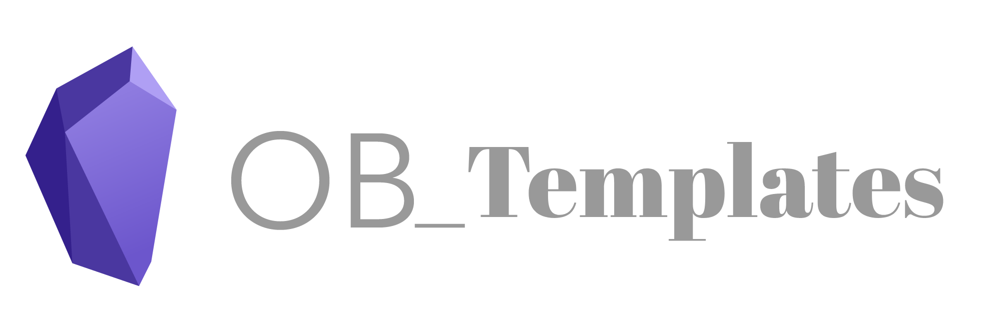

##### *Obsidian templates*
An <a href="https://obsidian.md/">Obsidian</a> template repository.

### [Download](#4-download)
#### View this repository on [Codeberg][01] or [GitHub][02].
[01]: https://codeberg.org/portellam/Obsidian-templates
[02]: https://github.com/portellam/Obsidian-templates
##

## Table of Contents
  - [1. What is Obsidian?](#1-what-is-obsidian)
  - [2. Why?](#2-why)
  - [3. Download](#3-download)
  - [4. Usage](#3-usage)
  - [5. FAQ](#5-faq)
  - [6. Contact](#6-contact)
  - [7. Special Thanks](#7-special-thanks)

## Contents
### 1. What is Obsidian?
**The human brain is non-linear: we jump from idea to idea, all the time. Your second brain should work the same.**

In Obsidian, the making and following of connections is frictionless. **Tend to your notes like a gardener;** at the end of the day, sit back and marvel at your own knowledge graph.

  - [Official Obsidian Website](https://obsidian.md)

### 2. Why?
Since the start of the project, there have been many changes; at first, it was a gathering place for templates. Soon after, it became a project aimed at onboarding new users to <a href="https://obsidian.md/">Obsidian</a> - with a very important rule. **All templates must use only the core plugins of Obsidian**

In time, we found that the plugin <a href="https://github.com/blacksmithgu/obsidian-dataview">DataView</a> became an essential tool for every user. **The goal of the project is to keep it as basic as possible, so as to not confuse new users.**

All the available templates are not designed to be perfect. They are intended to be used as a reference for any user to build on them, or to inspire when building new templates.

### 3. Download
- Download the `.zip` file:
    1. Viewing from the top of the repository's (current) webpage, click the
        drop-down icon:
        - `···` on Codeberg.
        - `<> Code ` on GitHub.
    2. Click `Download ZIP` and save.
    3. Open the `.zip` file, then extract its contents.

- Clone the repository:
    1. Open a Command Line Interface (CLI) or Terminal.
        - Open a console emulator (for Debian systems: Konsole).
        - **Linux only:** Open an existing console: press `CTRL` + `ALT` + `F2`,
        `F3`, `F4`, `F5`, or `F6`.
            - **To return to the desktop,** press `CTRL` + `ALT` + `F7`.
            - `F1` is reserved for debug output of the Linux kernel.
            - `F7` is reserved for video output of the desktop environment.
            - `F8` and above are unused.
    2. Change your directory to your home folder or anywhere safe:
        - `cd ~`
    3. Clone the repository:
        - `git clone https://www.codeberg.org/portellam/obsidian-workflow-docs`
        - `git clone https://www.github.com/portellam/obsidian-workflow-docs`

### 4. Usage
*Obsidian Templates* is not a vault template, this is simply a folder of templates to be added in your vault. 

You can add the templates to your vault in different ways:
1. [Download](#3-download) the repository, extract the files and add to your vault.
2. Go to a specific template and copy the text (Make sure you open in raw mode) and copy the text to a file in your vault.

### 5. FAQ
#### 5.1. How may I add the templates?
  - **A:** Simply copy the templates folder (`\templates\` or `\99 - Templates\`), or the specific template file to your vault.

#### 5.2. How may I use the templates?
  - **A:** As a general rule, most templates need to be *imported*. In other words, make sure you have at least the `Obsidian native templates` option enabled and configured.

#### 5.3. May I contribute to the repository?
  - **A:** YES! You are free to submit any template you use.

#### 5.4. May I clone the repository?
  - **A:** Yes, just make sure to acknowledge credits.

#### 5.5. Are there any prerequisite plugins to use the templates?
  - **A:** Yes.

##### 5.5.a. Required plugins:
  - <a href="https://github.com/blacksmithgu/obsidian-dataview">DataView</a>
  - <a href="https://github.com/tgrosinger/advanced-tables-obsidian">Advanced Tables</a>

##### 5.5.b. Recommended plugins: 
  - <a href="https://github.com/Aidurber/obsidian-plugin-dynamic-toc">Dynamic Table of Contents</a>.

#### 5.6. What is the meaning of the Tags?
  - **A:** All the Tags in the templates are just examples. You may add or remove any Tags you would like. To learn more: <a href="https://help.obsidian.md/How+to/Working+with+tags">how to work with Tags in Obsidian</a>.

#### 5.7. My question/issue is not listed here, how may I get an answer?
  - **A:** For any queries please head to the Obsidian forum and check the <a href="https://forum.obsidian.md/t/obsidian-notes-template/28940">OB_Template Thread</a>.

### 6. Contact
Do you need help? Please visit the [Issues][61] page.

[61]: https://github.com/portellam/Obsidian-workflow-docs/issues
##

### 7. Special Thanks
Order of credits are not reflective of the significance of listed contributions.
  - <a href="https://github.com/llZektorll">Hugo Santos</a> - Creator of the original repository.
  - <a href="https://github.com/portellam">Alex Portell</a> - Maintainer of this forked repository, refactoring and grammatical changes (with respect to American English).
  - <a href="https://github.com/FeFoe">Felix Förster</a> - Misplaced link correction.
  - <a href="https://github.com/kaleblub">Kaleb</a> - Added links to all plugin that are mentioned on the project as well as corrected some typos.
  - <a href="https://github.com/dbarenholz">Daniel Barenholz</a> - The template <a href="https://github.com/llZektorll/OB_Template/blob/main/0A_Templates/0A_17_WordDictionary/0A_17_1_WordDictionary.md">Word Dictionary</a> was created based on a conversation we had on Discord out of my need to create a dictionary for acronyms. Hero Achievement ✨
##

#### Click [here](#obsidian-templates) to return to the top of this document.